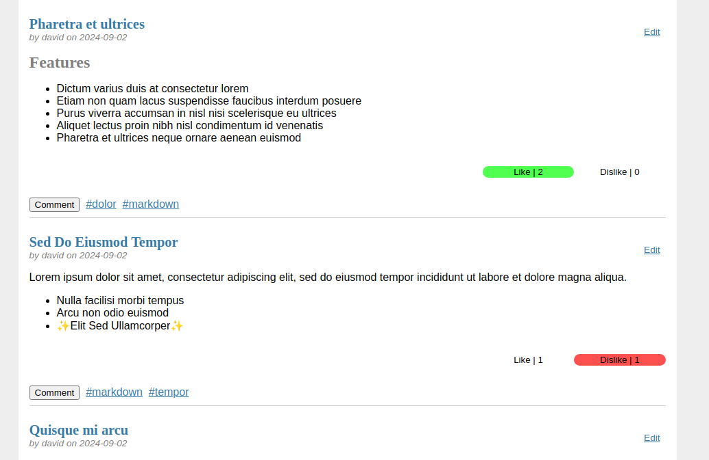
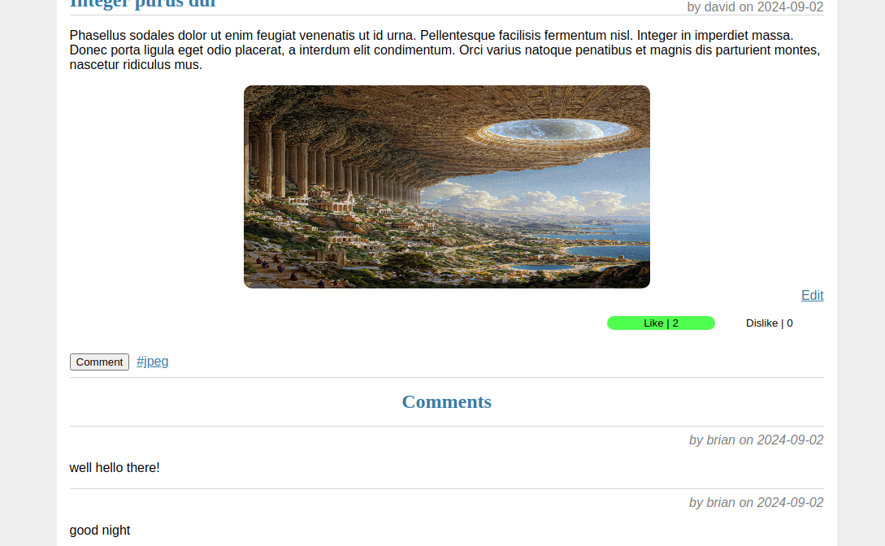
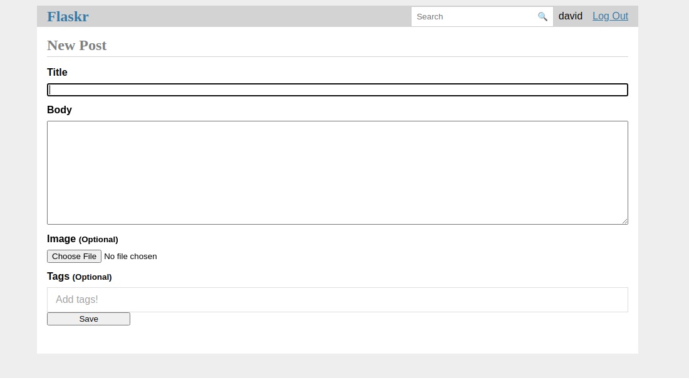
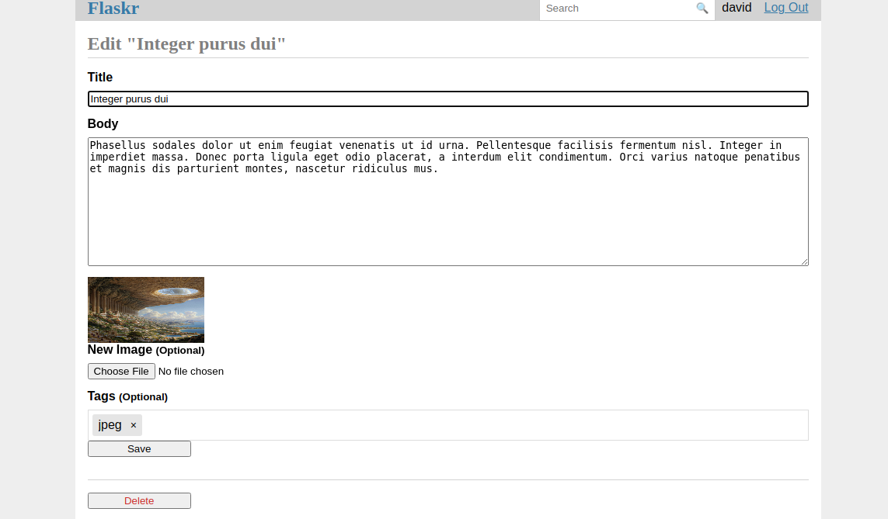

# literate-pancake
An expansion of the official Flask tutorial, implementing additional features from the [Keep Developing chapter](https://flask.palletsprojects.com/en/3.0.x/tutorial/next/).

__Features implemented:__ Detailed post views, likes and dislikes, comments, tags, search functionality, pagination, image uploads, Markdown formatting, and an RSS feed. 

## Video Demo:

## Description:
This project is a simple blog application built to learn and practice Flask. It includes basic functionality like creating posts, which are displayed in a main feed sorted by the most recent entries. Users can upload images, format their posts using Markdown, and add tags.

The application also allows users to comment on posts, like or dislike them, and search for content by title or author. Tags can be used to filter posts, and pagination is provided to help navigate through content. An RSS feed is included for following updates.
## Examples:
| Index | Comments |
| :---: | :---: |
|  |  |

| Post creation | Post editing |
| :---: | :---: |
|  |  |

## Prerequisites:
- Python 3.10.12 or above
- Git
- Packages listed in requirements.txt

## Technologies used:
- **Flask (Python)**: A lightweight WSGI web application framework.
- **SQLite**: A self-contained, serverless, zero-configuration SQL database engine.
- **Jinja**: A template engine for Python used to create dynamic HTML content.
- **HTML/CSS**: Markup and styling languages.
- **JavaScript**: Used for enhancing user experience.
- **Git**: Version control system to manage source code.

## Structure:
- `flaskr/`: Python package containing the application code and files.
- `tests/`: Directory containing test modules.
- `.venv/`: Python virtual environment where Flask and other dependencies will be installed. 
- `.gitignore`: Version control config.
- `pyproject.toml`: Configuration file for the project.
- `requirements.txt`: Packages required to run the project.
- `instance/`: Directory containing database and image files. 

> __Note:__ Some of these files and directories will be created after setting up and running the project.

## Setup:
1. Clone this repository:
```
git clone https://github.com/araujo2kg/literate-pancake
```
2. Change into the project directory:
```
cd literate-pancake
```
3. Create a virtual environment to run the project:
```
python3 -m venv .venv
```
4. Activate the virtual environment:
```
On Windows:
.venv\Scripts\activate

On macOS/Linux:
source .venv/bin/activate
```
5. Install the required packages:
```
pip install -r requirements.txt
pip install -e .
```
6. Initialize the database:
```
flask --app flaskr init-db
```
7. Run the project:
```
flask --app flaskr run --debug
```

## Tests:
1. Run the tests:
```
pytest
```
2. Run the tests with coverage:
```
coverage run -m pytest
```
3. Get coverage data:
```
coverage report
coverage html
```

## CS50:
This is my final project for the conclusion of the CS50’s Introduction to Computer Science course.

CS50x is an introduction to the intellectual enterprises of computer science and the art of programming. It is a free online version of Harvard University's CS50 course, designed for students with or without prior programming experience. 

The course covers a broad range of topics, including algorithms, data structures, software engineering, and web development, using languages such as C, Python, SQL, and JavaScript. Through problem sets and a final project, students gain hands-on experience and develop problem-solving skills applicable to real-world scenarios.

If you're interested in taking CS50x, you can enroll for free on [edX](https://www.edx.org/learn/computer-science/harvard-university-cs50-s-introduction-to-computer-science) or directly through [Harvard University's CS50 website](https://cs50.harvard.edu/x/).